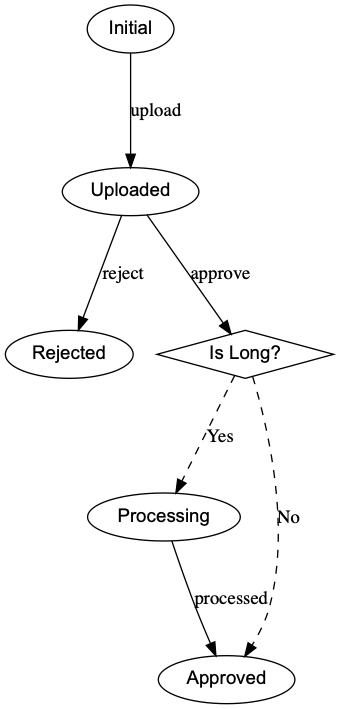

# State Machine \[Serverless App Template\]

Build and run your own advanced state machine as a service.
* AWS: API Gateway, Lambda, DynamoDB
* Python 3.7
* [Transitions](https://github.com/pytransitions/transitions)

## Prerequisites
* AWS Account
* AWS CLI
* SAM CLI
* Python 3.7
* (Optional) jq

## Running the example

The serverless app in this repository is an example built on the state machine as a service template.
It is a code template, all the pieces are in place for your own implementation.
The *functions* folder holds all the code for the example, everything else is part of the reusable template.
The state maching implementation is based on the [Transitions](https://github.com/pytransitions/transitions) library. "A lightweight, object-oriented state machine implementation in Python"

### The example

The example state machine - for a fictitious document approval procedure - is depicted on the next diagram.



The *is_long* condition checks if the document is too long. The idea is that long documents are then processed through a summarizer.  

## Deploying the example

1. Run the template generator script.

        python template.py > template.yaml

1. Create S3 bucket for deployment

    ```BUCKET NAME``` is where the deployment artefacts are placed

    ```REGION``` is where your bucket is created

        aws s3api create-bucket --bucket [BUCKET NAME] --create-bucket-configuration LocationConstraint=[REGION]

1. Build the project with SAM

        sam build --template template.yaml --build-dir ./dist

1. Package the project with SAM

        sam package --s3-bucket [BUCKET NAME] --template-file dist/template.yaml --output-template-file dist/packaged.yaml

1. Deploy the project with CloudFormation

        aws cloudformation deploy --template-file dist/packaged.yaml\
          --stack-name DocumentApproval --s3-bucket [BUCKET NAME]\
          --capabilities CAPABILITY_NAMED_IAM

## Removing the example

Remove the deployment (deleting stack) if the app is not needed anymore, or if something goes wrong during deployment that needs fixing before trying it again.

    aws cloudformation delete-stack --stack-name FilestoreAppStack

## User Guide
Soon coming to the [fnAttic website](https://fnattic.com).